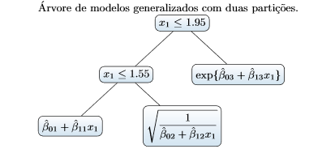

## Autores: Alberto Rodrigues Ferreira, Tibérius O. Bonates e Juvêncio Santos Nobre
### A ideia básica de uma AMG é de que subconjuntos de dados similares tenham um modelo de regressão que prediz melhor comparado a algum modelo de regressão ajustado com todos os dados

